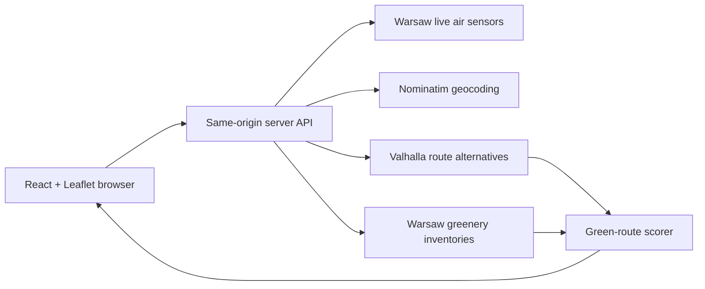

# Eco Navigate

Eco Navigate builds walking and cycling routes through Warsaw, then recommends the
alternative with the strongest nearby greenery without ignoring unreasonable
detours. The score uses current City of Warsaw inventories for trees, shrubs, and
forest areas. Live air-quality stations can be displayed alongside the route.

This repository is a working full-stack prototype. It no longer ships environmental
data snapshots or exposes the Warsaw API token in browser code.

## Features

- Search for a start and destination inside Warsaw
- Compare real pedestrian or bicycle route alternatives
- Score each route against live tree, shrub, and forest records
- Balance green exposure against added route distance
- Display the selected route, alternatives, environmental points, and endpoints
- Load token-protected Warsaw air-quality readings in real time
- Keep the Warsaw API token in a server-only environment variable
- Deploy the frontend and Node API together on Vercel
- Cache upstream responses to reduce load and improve repeat requests
- Responsive Leaflet interface with accessible controls and status messages

## How it works



The browser calls only `/api/air` and `/api/route`. Vite mounts the server middleware
from `server/ecoApi.js` in development and preview mode. On Vercel, the files in
`api/` expose the same shared logic as Node functions. Both adapters add the private
token only when calling the Warsaw air-sensor endpoint.

For a route request, the server:

1. Geocodes both place names within Warsaw.
2. Requests pedestrian or bicycle alternatives from Valhalla.
3. Identifies the Warsaw districts for the endpoints and route midpoint.
4. Fetches live tree, shrub, and forest records for those districts.
5. Samples each alternative about every 55 metres and measures nearby greenery.
6. Applies a detour penalty and returns the highest-ranked alternative.

The displayed `0–100` green score is a transparent heuristic, not a City of Warsaw
rating. Trees carry 55% of the local sample weight, shrubs 20%, and forest records
25%. The final ranking subtracts a penalty for distance above the shortest returned
alternative.

## Data and services

| Purpose | Source | Notes |
| --- | --- | --- |
| Air quality | [Warsaw Open Data API](https://api.um.warszawa.pl/) | Token required; provider refreshes readings approximately every 10 minutes |
| Individual trees | Warsaw resource `ed6217dd-c8d0-4f7b-8bed-3b7eb81a95ba` | Live datastore records |
| Individual shrubs | Warsaw resource `0b1af81f-247d-4266-9823-693858ad5b5d` | Live datastore records |
| Forest areas | Warsaw resource `75bedfd5-6c83-426b-9ae5-f03651857a48` | Live forest inventory points |
| Address search | [Nominatim Search API](https://nominatim.org/release-docs/latest/api/Search/) | Restricted to the Warsaw view box |
| Route alternatives | [Valhalla route API](https://valhalla.github.io/valhalla/api/turn-by-turn/api-reference/) | Pedestrian and bicycle costing |
| Basemap | [OpenStreetMap](https://www.openstreetmap.org/copyright) | Standard Leaflet tile layer |

Nominatim requests are serialized to one request per second, identify this project
with a custom user agent, and are cached. This follows the public service's
[usage policy](https://operations.osmfoundation.org/policies/nominatim/). The public
Valhalla instance is suitable for a prototype; a production deployment should use
a service with an explicit SLA or a self-hosted instance.

## Getting started

### Requirements

- Node.js 18 or newer
- npm
- A Warsaw Open Data API token from [api.um.warszawa.pl](https://api.um.warszawa.pl/)
- Internet access for the live APIs and map tiles

### Install

```bash
git clone https://github.com/Dymirt/Warsaw_moss.git
cd Warsaw_moss
npm install
cp .env.example .env.local
```

Set your token in `.env.local`:

```dotenv
WARSAW_API_TOKEN=your-real-token
```

Do not prefix this variable with `VITE_`. Vite exposes `VITE_*` values to browser
code; this token must remain server-side. `.env.local` is ignored by Git.

Start the app:

```bash
npm run dev
```

Open the URL printed by Vite, normally `http://localhost:5173`.

Do not open `dist/index.html` directly or serve `dist/` with a static-only server.
The browser needs the same-origin `/api/*` middleware to geocode places, calculate
routes, and keep the Warsaw token private.

## Available scripts

| Command | Purpose |
| --- | --- |
| `npm run dev` | Start the React app and same-origin API middleware with hot reload |
| `npm run build` | Build the browser application into `dist/` |
| `npm run preview` | Preview the build with the local API middleware |
| `npm run lint` | Run ESLint over client, server, and configuration files |

## API routes

### `GET /api/air`

Returns current Warsaw air stations through the token-protected upstream endpoint.
Responses are cached in server memory for five minutes.

### `POST /api/route`

Request:

```json
{
  "from": "Pałac Kultury i Nauki",
  "to": "Łazienki Królewskie",
  "mode": "walking"
}
```

`mode` accepts `walking` or `cycling`. The response includes resolved places,
candidate GeoJSON lines, the selected route ID, green scores, detour percentages,
nearby environmental points, aggregate record counts, and any partial-data
warnings. Greenery responses are cached per district for one hour.

### `GET /api/health`

Reports whether the local server is running and whether a Warsaw token is
configured. It never returns the token itself.

## Project structure

```text
.
├── api/                       # Vercel Function entrypoints
│   ├── air.js
│   ├── health.js
│   └── route.js
├── public/
│   └── eco-navigate.svg
├── server/
│   └── ecoApi.js              # API proxy, caches, routing, and scoring
├── src/
│   ├── banner/                # Route form, results, and layer controls
│   ├── maps/                  # Leaflet routes, stations, and greenery
│   ├── App.jsx                # Client data and interaction state
│   └── main.jsx               # React entry point
├── .env.example
├── .vercelignore
├── eslint.config.js
├── package.json
├── vercel.json                # Vercel build and function-duration settings
└── vite.config.js             # Mounts the local same-origin API middleware
```

There is intentionally no `src/data` snapshot directory. Environmental records
come from live upstream requests.

## Deploy to Vercel

The repository is configured as a Vite frontend with three Node-based Vercel
Functions. Import the GitHub repository into Vercel and keep the detected Vite
framework preset, `npm run build` command, and `dist` output directory.

In **Project Settings → Environment Variables**, add:

```text
WARSAW_API_TOKEN=<your Warsaw API token>
```

Enable it for Production and Preview, then redeploy. Do not upload `.env.local`;
`.vercelignore` explicitly excludes local environment files. `vercel.json` allows
up to 120 seconds for green-route calculation and shorter durations for the air and
health functions.

The route and greenery caches are held in function memory. They improve warm
requests but are not guaranteed to survive a serverless restart or be shared across
instances.

## Production notes

`npm run preview` is for local validation, not a production web server. A static
host can serve `dist/`, but it cannot safely hold the Warsaw API token or execute
the `/api/*` routes. Deploy the included Vercel Functions or use another Node-capable
runtime, then serve the browser build and API from the same origin.

If the interface reports that the Eco Navigate API is not running, the frontend is
being served without those `/api/*` routes. For local use, stop that static server
and use `npm run dev`, or run `npm run build` followed by `npm run preview`.

Recommended production work:

- Replace the public Valhalla endpoint with a contracted or self-hosted service.
- Move in-memory caches to a shared cache when running multiple server instances.
- Add request rate limiting, monitoring, and automated route-scoring tests.
- Add Warsaw district geometry for more exact cross-district inventory queries.
- Add park and lawn polygons when a reliable live municipal source is available.

## Limitations

- The green score measures proximity to inventory records; it does not measure
  shade, sidewalk quality, safety, accessibility, noise, or current construction.
- Warsaw's forest resource is represented by inventory points, not a rendered
  canopy polygon. Grass and lawn data are not currently available in the selected
  municipal resources.
- The first route through a district can take longer while live inventories load;
  subsequent requests use the server cache.
- Air-quality readings are informational and should not replace official health
  guidance.

## Authors

- Ziad Karoune
- Dmytro Kolida
