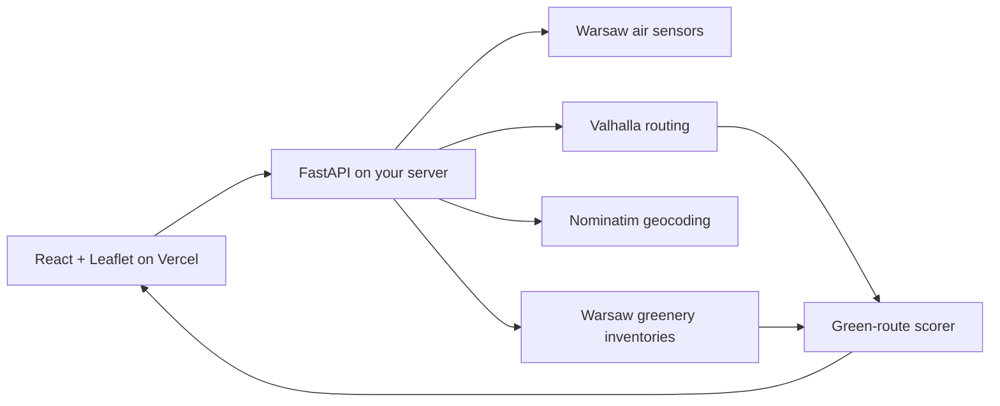

# Eco Navigate

Eco Navigate compares walking and cycling routes through Warsaw and recommends the
alternative with stronger nearby greenery without accepting an unreasonable detour.
The map shows route alternatives, trees, shrubs, forest inventory points, and live
air-quality stations.

This repository is the React and Leaflet frontend. The API, route scoring, upstream
requests, private Warsaw token, and persistent caches live in the separate
[Eco Navigate FastAPI repository](https://github.com/Dymirt/econavigate_FastApi).

## Features

- Search for a start and destination in Warsaw.
- Compare real pedestrian and bicycle alternatives.
- Display the green score and detour for every route.
- Show nearby environmental inventory records and live air stations.
- Center the map on the user's location with explicit browser permission.
- Deploy as a static Vite application on Vercel; no Vercel Function is required.

## Architecture



The browser calls `GET /api/air` and `POST /api/route` on the origin configured by
`VITE_API_BASE_URL`. It never receives the Warsaw API token. The FastAPI backend
keeps that token in its server-side `.env.local` file and caches slow-changing
greenery inventories on persistent storage.

## Local development

### Requirements

- Node.js 18 or newer and npm.
- A running copy of
  [econavigate_FastApi](https://github.com/Dymirt/econavigate_FastApi), normally on
  `http://127.0.0.1:8000`.

### Start the frontend

```bash
git clone https://github.com/Dymirt/Warsaw_moss.git
cd Warsaw_moss
npm install
cp .env.example .env.local
npm run dev
```

The default local configuration is:

```dotenv
VITE_API_BASE_URL=http://127.0.0.1:8000
```

Open the URL printed by Vite, normally <http://localhost:5173>. The backend must
allow this origin through its `CORS_ORIGINS` setting.

`VITE_API_BASE_URL` is public configuration included in the browser bundle. Never
put `WARSAW_API_TOKEN` or another secret in this repository, in Vercel, or in any
variable prefixed with `VITE_`.

## Scripts

| Command | Purpose |
| --- | --- |
| `npm run dev` | Run the Vite development server with hot reload. |
| `npm run build` | Build the static production application into `dist/`. |
| `npm run preview` | Preview the static production build. |
| `npm run lint` | Run ESLint over the frontend source and configuration. |

## Deploy the frontend to Vercel

1. Deploy the FastAPI repository on a server with an HTTPS domain, for example
   `https://api.eco-navigate.example`.
2. Add the production frontend origin, such as
   `https://warsaw-moss.vercel.app`, to the backend's `CORS_ORIGINS`.
3. Import this repository into Vercel with the Vite preset.
4. Add this Vercel environment variable for Production and Preview:

   ```text
   VITE_API_BASE_URL=https://api.eco-navigate.example
   ```

5. Redeploy and verify the browser's requests to `/api/health`, `/api/air`, and
   `/api/route` in its network panel.

The frontend is fully static, so Vercel Function duration and egress limits no
longer apply. Both sites must use HTTPS in production or the browser will block the
API request as mixed content.

## API contract

### `POST /api/route`

```json
{
  "from": "Pałac Kultury i Nauki",
  "to": "Łazienki Królewskie",
  "mode": "walking"
}
```

`mode` accepts `walking` or `cycling`. The response includes the resolved places,
candidate GeoJSON lines, selected route ID, green scores, detour percentages,
nearby environmental points, aggregate counts, warnings, and calculation time.

### `GET /api/air`

Returns the current Warsaw air stations and their fetch timestamp.

### `GET /api/health`

Reports backend readiness, whether its Warsaw token is configured, and
non-sensitive cache statistics.

See the backend's `/docs` page for the generated OpenAPI interface.

## Project structure

```text
.
├── public/                    # Static brand assets
├── src/
│   ├── banner/                # Search form, route results, and layer controls
│   ├── maps/                  # Leaflet routes, stations, and greenery
│   ├── api.js                 # FastAPI client and error handling
│   ├── App.jsx                # Client data and interaction state
│   └── main.jsx               # React entry point
├── .env.example               # Public API-origin example only
├── package.json
├── vercel.json                # Static Vite deployment
└── vite.config.js
```

There are intentionally no API handlers, environmental data snapshots, server
middleware, or secrets in this frontend repository.

## Data sources and limitations

The backend combines the
[Warsaw Open Data API](https://api.um.warszawa.pl/),
[Nominatim](https://nominatim.org/),
[Valhalla](https://valhalla.github.io/valhalla/), and
[OpenStreetMap](https://www.openstreetmap.org/copyright).

The green score is a route-ranking heuristic, not an official City of Warsaw rating.
It measures proximity to available inventory records and does not measure shade,
sidewalk quality, safety, accessibility, noise, temporary closures, or construction.
Grass and lawn polygons are not included until a suitable live municipal dataset is
available.

## Authors

- Ziad Karoune
- Dmytro Kolida
